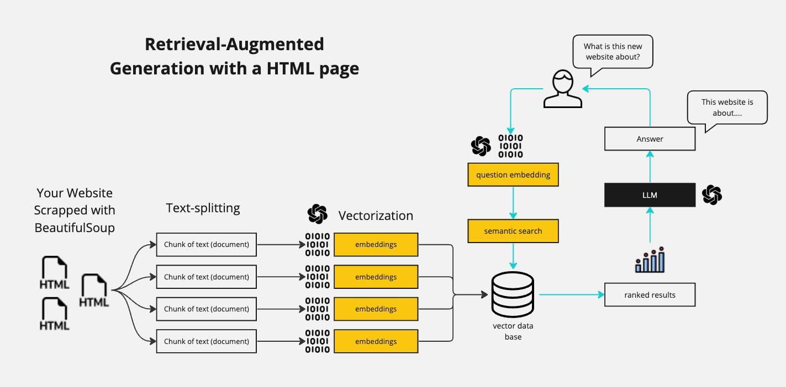

# AI Learning - Chatting with a Website using Python, Langchain, and Streamlit

## Table of Contents
1. [Introduction](#introduction)
2. [The Problem](#the-problem)
3. [Our Solution](#our-solution)
4. [Retrieval-Augmented Generation (RAG)](#retrieval-augmented-generation-rag)
5. [Implementation Details](#implementation-details)
6. [Running the Code](#running-the-code)
7. [Contributing](#contributing)

## Introduction
In this repository, we will explore how to build an AI-driven chatbot that interacts with a website using Python, Langchain, and Streamlit. The objective is to enable a dynamic conversation with the content of any given website, leveraging cutting-edge AI technologies like Large Language Models (LLMs) and Retrieval-Augmented Generation (RAG).

## The Problem
Websites often contain vast amounts of information that users need to access quickly and efficiently. Traditional search methods can be time-consuming and may not always yield the desired results. There is a need for an intelligent system that can understand user queries and provide precise answers by interacting with the content of a website.

## Our Solution
We propose developing an AI-driven software system that leverages RAG to enhance website interactions. By combining the capabilities of LLMs and advanced retrieval techniques, this system can dynamically engage with website content, providing users with accurate and contextually relevant information. The solution will use BeautifulSoup for web scraping, Langchain for embedding and conversational capabilities, and Streamlit for the user interface.

## Retrieval-Augmented Generation (RAG)
### What is RAG?
Retrieval-Augmented Generation (RAG) is a technique that combines retrieval-based and generation-based methods to produce high-quality text responses. The retrieval component searches a database to find relevant information, while the generation component uses this information to create coherent and contextually appropriate responses.

### How RAG Works
RAG leverages a combination of retriever and generator models:
1. **Retriever Model**: Searches a large corpus to find relevant documents based on a query.
2. **Generator Model**: Generates a detailed and contextually appropriate response using the retrieved documents.

### Use Cases of RAG
- **Question Answering**: Provides precise answers by retrieving relevant documents and generating a comprehensive response.
- **Conversational Agents**: Enhances chatbots by enabling them to access a vast knowledge base and generate accurate answers.

### Steps of RAG (Explanation of the Image)
1. **Web Scraping**: Using BeautifulSoup, we extract the content of the target website and split it into manageable chunks.
2. **Text-splitting**: The scraped content is divided into smaller, coherent chunks of text.
3. **Vectorization**: These chunks are transformed into embeddings using Langchain's embedding models.
4. **Semantic Search**: ChromaDB stores these embeddings and performs semantic searches based on user queries.
5. **Question Embedding**: The user's question is transformed into an embedding.
6. **Semantic Search with Question Embedding**: The question embedding is used to search the vector database for relevant chunks.
7. **Ranked Results**: The search results are ranked based on relevance.
8. **LLM Integration**: Langchain's conversational capabilities are used to create a history-aware chatbot that interacts with the user and the website's content.
9. **Answer Generation**: The system generates an answer based on the ranked results and the LLM's capabilities.



## Implementation Details
### Step-by-Step Explanation
1. **Web Scraping**: Extract the content of the target website using BeautifulSoup and split it into manageable chunks.
2. **Vectorization**: Transform these chunks into embeddings using Langchain's embedding models.
3. **Semantic Search**: Use ChromaDB to store these embeddings and perform semantic searches based on user queries.
4. **Conversational Agent**: Utilize Langchain's conversational capabilities to create a history-aware chatbot that interacts with the user and the website's content.

## Running the Code
To run the code in this repository, follow these steps:

1. Clone the repository:
    ```bash
    git clone https://github.com/AlejandroVivasDB/AI-Learning.git
    cd AI-Learning
    ```

2. Create and activate a virtual environment:
    ```bash
    python -m venv venv
    source venv/Scripts/activate  # On Windows
    # or
    source venv/bin/activate  # On Unix or MacOS
    ```

3. Install the required dependencies:
    ```bash
    pip install -r requirements.txt
    ```

4. Set up environment variables by creating a `.env` file:
    ```bash
    OPENAI_API_KEY=[your-openai-api-key]
    ```

5. Run the Streamlit app:
    ```bash
    streamlit run app.py
    ```

## Contributing
We welcome contributions to this repository. If you have any improvements or suggestions, please create a pull request or open an issue to discuss your ideas.
